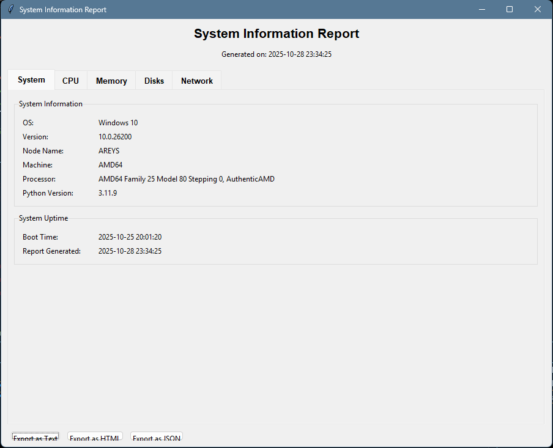

# System Information Generator

A Python-based tool to collect and display detailed system information, including hardware, software, and network details. The tool features an interactive GUI and can generate reports in multiple formats (text, HTML, JSON) for easy analysis and integration with other tools.

## Features

- **Interactive GUI**: Modern, tabbed interface with real-time system monitoring
  - System overview with detailed specifications
  - CPU usage with per-core monitoring
  - Memory and swap usage with visual indicators
  - Disk information in a sortable table
  - Network interface details and I/O statistics

- **Comprehensive System Information**: Collects detailed information about:
  - System (OS, version, hostname, etc.)
  - CPU (cores, usage, frequency)
  - Memory (RAM and swap usage)
  - Disk (partitions, usage, file systems)
  - Network (interfaces, IP addresses, I/O statistics)
  - System uptime and boot time

- **Multiple Output Formats**:
  - Interactive GUI (default) with export options
  - Human-readable text format
  - HTML report with a clean, responsive design
  - JSON format for programmatic use
  - CSV format for spreadsheet applications
  - PDF format for documentation and sharing

- **Cross-Platform**: Works on Windows, macOS, and Linux

## Requirements

- Python 3.6+
- Required packages (automatically installed via `requirements.txt`):
  - `psutil` - For system information gathering
  - `platformdirs` - For consistent cross-platform paths
  - `reportlab` - For PDF report generation
  - `fpdf2` - Alternative PDF generation
  - `pandas` - For data handling and CSV export

> **Note for Linux Users**: 
> On some Linux distributions, you might need to install `python3-tk` for the GUI to work:
> ```bash
> # For Ubuntu/Debian
> sudo apt-get install python3-tk
> ```

## Installation

1. Clone the repository:
   ```bash
   git clone https://github.com/Areyxc/SystemInfoGenerator.git
   cd SystemInfoGenerator
   ```

2. Install the required packages:
   ```bash
   pip install -r requirements.txt
   ```

## Usage

### Basic Usage

```bash
# Launch the interactive GUI (default)
python system_info.py

# Or specify the GUI explicitly
python system_info.py --output gui
```

### Command-line Options

```
usage: system_info.py [-h] [--output {text,html,json,gui}] [--file FILE]

Generate system information reports.

optional arguments:
  -h, --help            show this help message and exit
  --output {text,html,json,csv,pdf,gui}, -o {text,html,json,csv,pdf,gui}
                        Output format (default: gui)
  --file FILE, -f FILE  Output file path (default: auto-generated filename)
```

### GUI Features

The interactive GUI provides a user-friendly way to explore system information:

- **Tabbed Interface**: Easily navigate between different system categories
- **Visual Indicators**: Progress bars for CPU, RAM, and swap usage
- **Sortable Tables**: Disk and network information in sortable tables
- **Export Options**: Save reports in multiple formats (Text, HTML, JSON, CSV, PDF)
- **Responsive Design**: Adapts to different window sizes

### Examples

1. **Launch the GUI** (default):
   ```bash
   python system_info.py
   ```

2. Generate an HTML report:
   ```bash
   python system_info.py --output html --file system_report.html
   ```

3. Generate a JSON report and print to console:
   ```bash
   python system_info.py --output json
   ```

4. Save a text report with a custom filename:
   ```bash
   python system_info.py --output text --file my_system_info.txt
   ```

5. Generate a CSV report for spreadsheet analysis:
   ```bash
   python system_info.py --output csv --file system_report.csv
   ```

6. Generate a PDF document:
   ```bash
   python system_info.py --output pdf --file system_report.pdf
   ```

7. Generate a report without opening the GUI:
   ```bash
   # This will generate a text report without showing the GUI
   python system_info.py --output text --file report.txt
   ```

## Output Examples

### Interactive GUI


The GUI provides a comprehensive view of your system's status with multiple tabs:
- **System**: General system information and uptime
- **CPU**: Core usage and frequency information
- **Memory**: RAM and swap usage with progress bars
- **Disks**: Detailed disk information in a sortable table
- **Network**: Network interfaces and I/O statistics

### Text Report
```
==================================================
SYSTEM INFORMATION REPORT - 2025-10-29 02:28:45
==================================================

SYSTEM INFORMATION
------------------------------
System: Windows
Node Name: DESKTOP-ABC123
Release: 10
Version: 10.0.19045
Machine: AMD64
Processor: Intel64 Family 6 Model 158 Stepping 10, GenuineIntel
Python Version: 3.11.9

CPU INFORMATION
------------------------------
Physical Cores: 8
Total Cores: 16
CPU Usage: 12.3%
CPU Frequency: 3600.0 MHz

MEMORY INFORMATION
------------------------------
Total RAM: 31.92 GB
Available RAM: 18.56 GB
Used RAM: 13.36 GB (41.9%)
Total Swap: 36.00 GB
Used Swap: 2.45 GB (6.8%)
...
```

### HTML Report
Generates a responsive HTML page with the same information in a more visually appealing format, perfect for sharing or documentation.

### CSV Report
Generates a comma-separated values file that can be opened in spreadsheet applications like Microsoft Excel or Google Sheets. The CSV format is ideal for data analysis and processing.

### PDF Report
Creates a professional-looking PDF document with formatted tables and system information. The PDF is perfect for documentation, reports, or sharing system specifications in a portable format.

### JSON Output
```json
{
    "timestamp": "2025-10-29 02:28:45",
    "system": {
        "system": "Windows",
        "node_name": "DESKTOP-ABC123",
        "release": "10",
        "version": "10.0.19045",
        "machine": "AMD64",
        "processor": "Intel64 Family 6 Model 158 Stepping 10, GenuineIntel",
        "python_version": "3.11.9"
    },
    "cpu": {
        "physical_cores": 8,
        "total_cores": 16,
        "cpu_percent": [12.3, 8.5, 15.2, ...],
        "cpu_freq": {
            "current": 3600.0,
            "max": 4500.0
        }
    },
    ...
}
```
## Group Project for System Administration and Maintenance [BSIT - 4F] (S.Y. 2025)

This is solely made by Group 5 for project purposes to be passed to our professor.

## GROUP 5 Members

- **Belza, John Jaylyn**
- **Constantino, Alvin Jr.**
- **Sabangan, Ybo**
- **Santiago, James Aries**
- **Silvestre, Jesse Lei**

## License

This project is licensed under the MIT License - see the [LICENSE](LICENSE) file for details.

## Contributing

Contributions are welcome! Please feel free to submit a Pull Request.

## Future Enhancements

- [ ] Add logging for audits
- [ ] Integrate matplotlib for charts (e.g., CPU pie)
- [ ] Add system tray integration for quick access
- [ ] Add dark/light theme support

## Known Issues

- On some Linux distributions, you might need to install additional packages for the GUI to work properly
- The first launch might be slightly slower as it collects all system information
